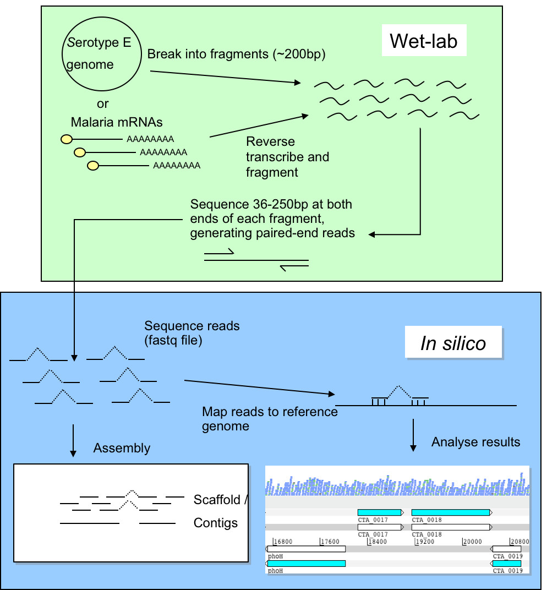

# Mapping

Next-generation sequencing data is being produced at an ever-increasing rate. The raw data is not meaningful by itself and needs to be processed using various bioinformatic software. This practical will focus on genomic resequencing data where the raw data is aligned to a reference genome.

## Introduction
Improvements in DNA sequencing technology have led to new opportunities for studying organisms at the genomic and transcriptomic levels. Applications include studies of genomic variation within species and gene identification. In this module we will concentrate on data generated using the Illumina Genome Analyzer II technology, although the techniques you will learn are applicable to other technologies (e. g. 454 GS FLX and ABI SOLiD). A single machine can produce around 20 Gigabases of sequence data in a week. This is the equivalent to over 6 human genomes. The data from the Illumina machine comes as relatively short stretches of 35 - 250 base pairs (bp) of DNA - around 300 million of them. These individual sequences are called <strong>reads</strong>. The older capillary sequencing technology generates longer reads of ~500 bp, but the approach is much slower and more expensive.

One of the greatest challenges of sequencing a genome is determining how to arrange sequencing reads into chromosomes. This process of determining how the reads fit together by looking for overlaps between them is called genome assembly. Capillary sequencing reads (~500bp) are considered a good length for genome assembly. Genome assembly using sequence reads of &lt;100bp is more complicated due to the high frequency of repeats longer than the read length. Assemblies for bacterial genomes can comprise of at least 50 pieces (called “contigs”), whilst for Eukaryotes more than 1000 pieces is common. Therefore new sequencing technologies are applied predominantly where a reference genome already exists. A reference genome is a well assembled genome from the same or a similar organism that is undergoing sequencing. Sequencing a genome with new technology when there is an existing reference is called resequencing.

In this practical, we will focus on mapping reads to a reference genome and visualising the resulting alignments using <a href="https://ics.hutton.ac.uk/tablet/">Tablet</a>.

## Sequencing/Mapping workflow

The diagram below describes the workflows for genomic resequencing and RNA sequencing. We will cover the in silico (computational) aspects of these workflows.



When resequencing, instead of assembling the reads to produce a new genome sequence and then comparing the two genome sequences, we map the new sequence data to the reference genome. We can then identify Single Nucleotide Polymorphisms (SNPs), insertions and deletions (indels) and Copy Number Variants (CNVs) between two similar organisms.

The first example we use here is a reference genome for <i>Plasmodium falciparum</i> (3D7 clone, size 23Mb, 81% AT content) (Gardener et al., 2002). This parasite is the causative agent of malaria. Malaria is widespread in tropical and subtropical regions, including parts of the Americas, Asia, and Africa. Each year, there are approximately 350–500 million cases of malaria, killing between one and three million people, the majority of whom are young children in sub-Saharan Africa. Recently we sequenced two laboratory strains, IT and DD2, using 76 bp paired end read technology. The second example is using the reference genome for <i>Mycobacterium tuberculosis</i> (H37Rv, size 4.4Mb, GC content 65.6%) (Cole et al, 1998). This bacterium causes tuberculosis disease.

Rather than attempting to assemble these very short reads into a whole new genome, we will map them against the existing genome assembly of <i>P. falcipraum</i> (3D7) or <i>M. tuberculosis</i> (H37Rv). Furthermore, we will identify differences between the genomes of the three clones, find mutations and CNVs associated to drug resistance, whilst determining how the reads fit together.

Here is the general workflow of mapping:
1. The paired end reads (F=forward; R=reverse) are mapped against the reference. Different tools can be used for that. The results can be transformed with <a href="https://github.com/samtools/samtools">samtools</a> to an ordered and indexed bam file.
2. Those bam files can be read into programs like Artemis to visualize the alignments of the short sequences.
3. From the bam file it is possible to call variants. The output format is BCF or VCF. VCF can be loaded easily into excel like tools.


Quality control of the reads is always important, to correct for any GC content biases, possible contamination, and read quality.

!!! important
    Before doing anything, we need to first activate the conda environment for this practical by typing the following: `conda activate mapping`. This environment contains most of the software we need for this practical. This command needs to be run each time we open up a new terminal or switch from a different environment. 

## File formats

You have the P. falciparum 3D7 clone reference file (Pf3D7_05.fasta). This contains the assembled sequence of the 3D7 genome. You also have two files of sequence reads from the IT clone (IT.Chr5_1.fastq.gz and IT.Chr5_2.fastq.gz). Look in both the reference file and the read files. 

### FASTA format

In the terminal navigate to the data/malaria directory, by typing:

```
cd ~/data/malaria/
head -n 5 Pf3D7_05.fasta
```

Hover over the output below to get an explanation

Hit the following keys: ++ctrl+alt+del++

!!! Question    

    === "Question"

        How many reads have been mapped?

    === "Answer"

        Run the following code and you'll see that we have 1000 reads mapping
        ``` bash
        samtools flgastat sample1.bam
        ```


